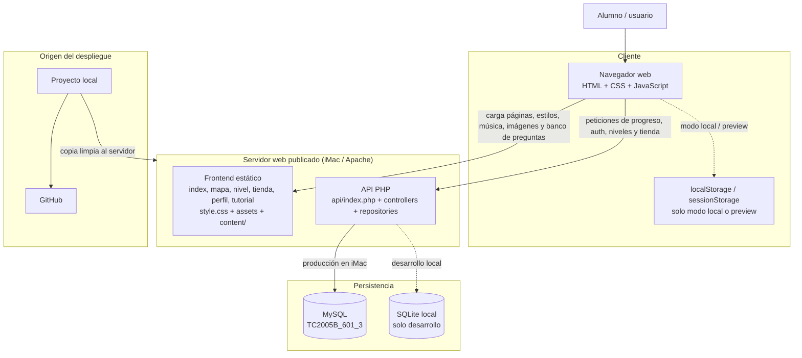

## Diagrama De Despliegue

```mermaid
flowchart TB
    Usuario[Alumno / usuario]

    subgraph Cliente["Cliente"]
        Navegador["Navegador web<br/>HTML + CSS + JavaScript"]
        Storage["localStorage / sessionStorage<br/>solo modo local o preview"]
    end

    subgraph Servidor["Servidor web publicado (iMac / Apache)"]
        Frontend["Frontend estático<br/>index, mapa, nivel, tienda, perfil, tutorial<br/>style.css + assets + content/"]
        API["API PHP<br/>api/index.php + controllers + repositories"]
    end

    subgraph Persistencia["Persistencia"]
        MySQL[("MySQL<br/>TC2005B_601_3")]
        SQLite[("SQLite local<br/>solo desarrollo")]
    end

    subgraph Fuente["Origen del despliegue"]
        Local["Proyecto local"]
        GitHub["GitHub"]
    end

    Usuario --> Navegador
    Navegador -->|carga páginas, estilos, música, imágenes y banco de preguntas| Frontend
    Navegador -->|peticiones de progreso, auth, niveles y tienda| API
    Navegador -. modo local / preview .-> Storage
    API -->|producción en iMac| MySQL
    API -. desarrollo local .-> SQLite
    Local --> GitHub
    Local -->|copia limpia al servidor| Servidor
```
