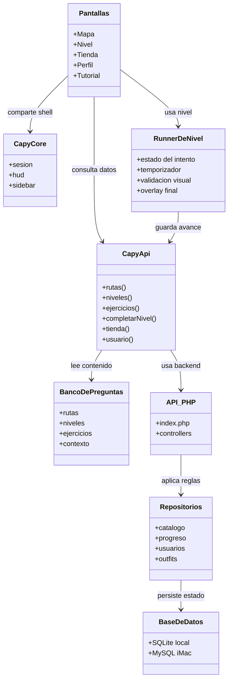

## Diagrama De Objetos

```mermaid
classDiagram
    class Pantallas {
      +Mapa
      +Nivel
      +Tienda
      +Perfil
      +Tutorial
    }

    class CapyCore {
      +sesion
      +hud
      +sidebar
    }

    class CapyApi {
      +rutas()
      +niveles()
      +ejercicios()
      +completarNivel()
      +tienda()
      +usuario()
    }

    class RunnerDeNivel {
      +estado del intento
      +temporizador
      +validacion visual
      +overlay final
    }

    class BancoDePreguntas {
      +rutas
      +niveles
      +ejercicios
      +contexto
    }

    class API_PHP {
      +index.php
      +controllers
    }

    class Repositorios {
      +catalogo
      +progreso
      +usuarios
      +outfits
    }

    class BaseDeDatos {
      +SQLite local
      +MySQL iMac
    }

    Pantallas --> CapyCore : comparte shell
    Pantallas --> CapyApi : consulta datos
    Pantallas --> RunnerDeNivel : usa nivel
    CapyApi --> BancoDePreguntas : lee contenido
    CapyApi --> API_PHP : usa backend
    RunnerDeNivel --> CapyApi : guarda avance
    API_PHP --> Repositorios : aplica reglas
    Repositorios --> BaseDeDatos : persiste estado
```
