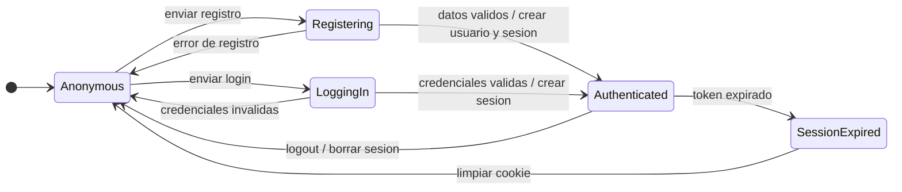
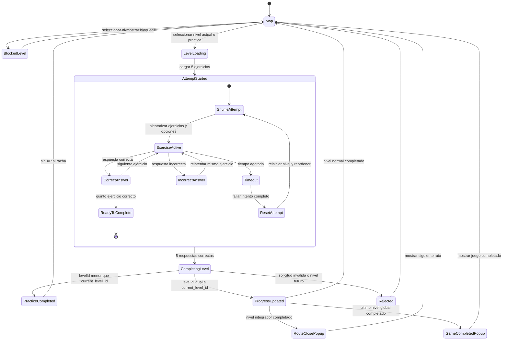
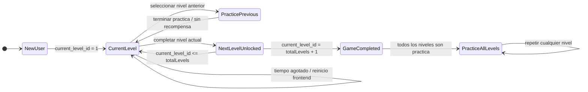
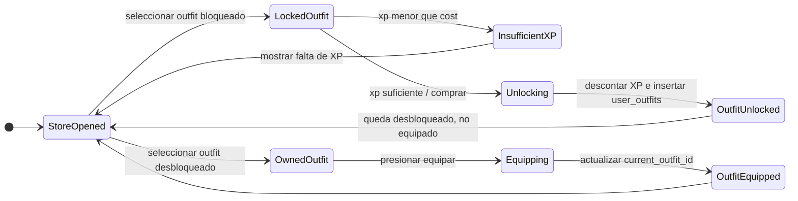
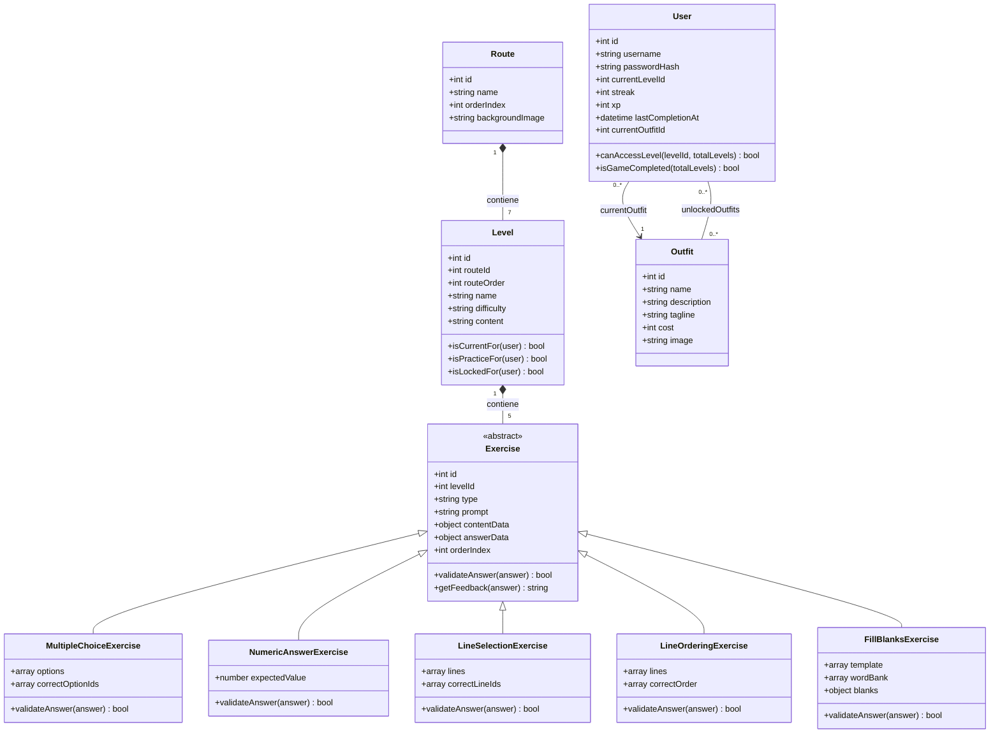
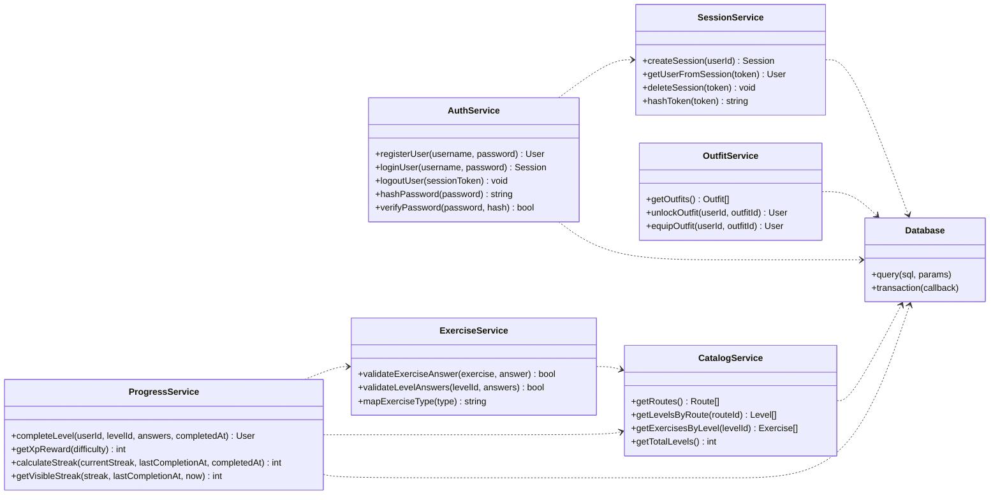
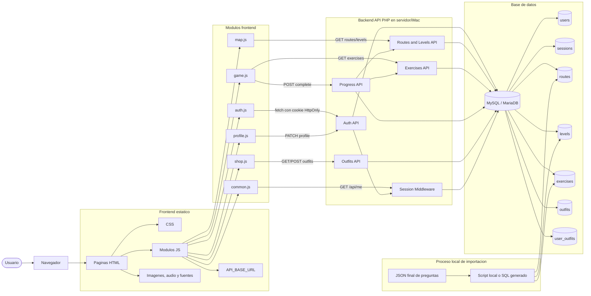
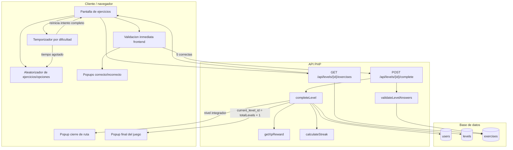
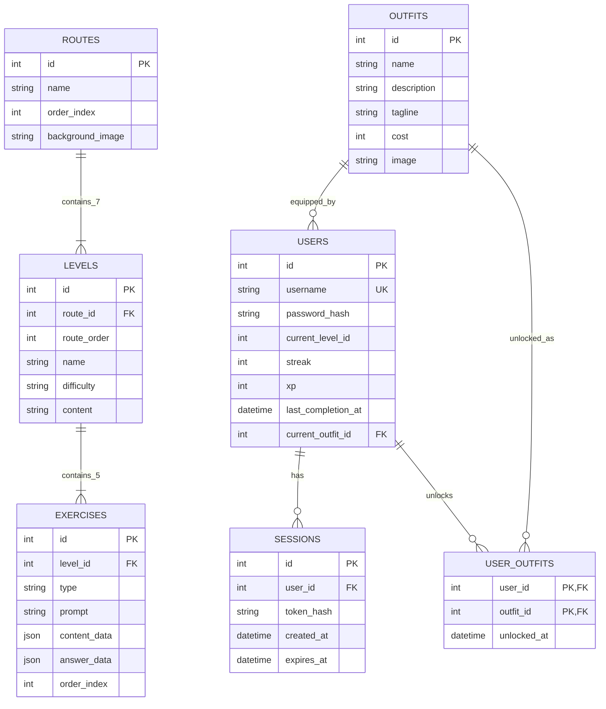
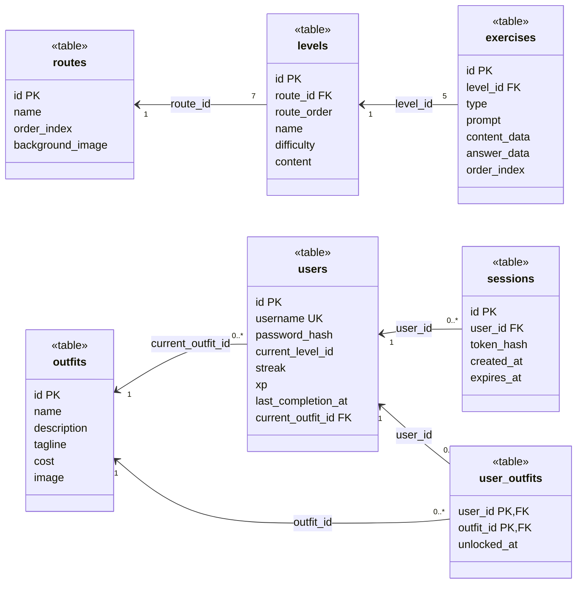

# CapyCode - Codigos de diagramas finales

Fecha de generacion: 2026-04-30

Este archivo contiene los codigos Mermaid propuestos para los diagramas finales de CapyCode. Estan separados para mantener claridad visual y evitar diagramas demasiado saturados.

Notas generales:

- `current_level_id` es un puntero entero de progreso, no una FK estricta, porque puede tomar el valor `totalLevels + 1` cuando el juego esta completado.
- `routes.name` representa el tema de la ruta. No existe `routes.topic`.
- `levels.content` es texto breve fijo guardado en base de datos.
- `exercises.content_data` y `exercises.answer_data` pueden ser columnas `JSON` o `TEXT` con JSON valido.
- Los popups, audio, temporizadores, aleatorizacion y efectos visuales son frontend puro.

## 1. Diagramas de estados

### 1.1. Estado de autenticacion y sesion



### 1.2. Estado de partida de nivel



### 1.3. Estado de progreso global



### 1.4. Estado de tienda y vestuarios



## 2. Diagramas de clases

### 2.1. Diagrama de clases de dominio



Nota: `Session` no se incluye en este diagrama principal porque es una entidad tecnica de autenticacion, no una clase del dominio jugable. Si se necesita mostrarla, aparece en el ER o en el diagrama tecnico de servicios backend.

### 2.2. Diagrama de clases de servicios backend



## 3. Diagramas de componentes

### 3.1. Diagrama de componentes general



### 3.2. Diagrama de componentes de juego y progreso



## 4. Base de datos

### 4.1. Diagrama ER



Nota para el ER:

- `users.current_level_id` no se dibuja como relacion FK estricta hacia `levels.id`, porque el valor `totalLevels + 1` representa juego completado y no existe como fila en `levels`.
- `users.current_outfit_id` si referencia a `outfits.id`.

### 4.2. Diagrama relacional



Restricciones relacionales recomendadas:

```sql
users.username UNIQUE
users.current_level_id CHECK (current_level_id >= 1)
users.streak CHECK (streak >= 0)
users.xp CHECK (xp >= 0)
routes.order_index UNIQUE
levels.route_id REFERENCES routes(id)
levels UNIQUE(route_id, route_order)
levels CHECK(route_order BETWEEN 1 AND 7)
levels CHECK(difficulty IN ('easy', 'medium', 'hard', 'integrative'))
exercises.level_id REFERENCES levels(id)
exercises UNIQUE(level_id, order_index)
exercises CHECK(order_index BETWEEN 1 AND 5)
outfits.cost CHECK(cost >= 0)
users.current_outfit_id REFERENCES outfits(id)
sessions.user_id REFERENCES users(id)
user_outfits PRIMARY KEY(user_id, outfit_id)
user_outfits.user_id REFERENCES users(id)
user_outfits.outfit_id REFERENCES outfits(id)
```

Nota:

- El limite superior de `users.current_level_id` debe validarse en backend contra `totalLevels + 1`, porque depende del catalogo importado.
- Si la base de datos permite `CHECK` con subconsultas o triggers, se puede reforzar ahi; para mantenerlo simple, basta con validarlo en PHP.
