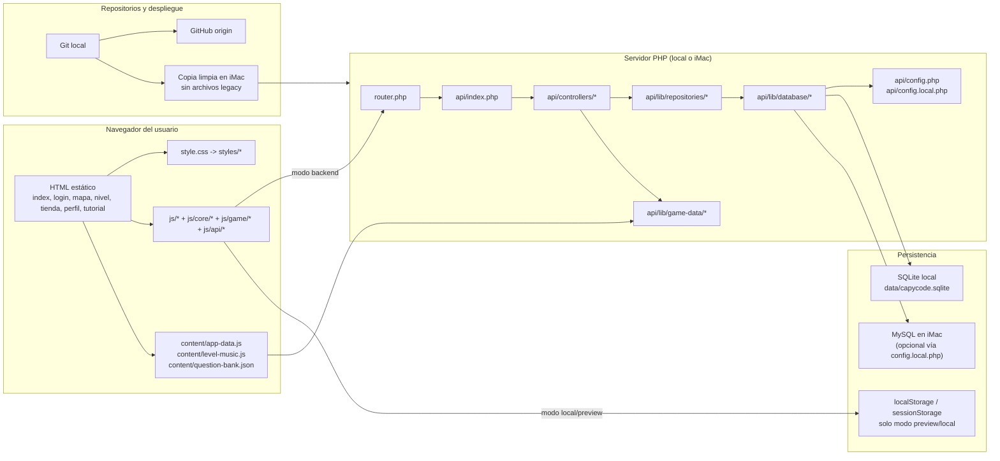

# Diagramas Mermaid

## Diagrama De Objetos

```mermaid
classDiagram
    class PaginaHTML {
      +index.html
      +iniciar_sesion.html
      +registro.html
      +mapa.html
      +nivel.html
      +tienda.html
      +perfil.html
      +tutorial.html
    }

    class CapyCore {
      +ensureSession()
      +getProfile()
      +saveProfile()
      +updateHud()
      +renderSidebarNav()
      +renderSidebarSkins()
    }

    class CapyApi {
      +getRoutes()
      +getLevelsByRoute()
      +getExercisesByLevel()
      +completeLevel()
      +buyOutfit()
      +equipOutfit()
      +getCurrentUser()
    }

    class ApiCatalog {
      +createRuntime()
      +getRoutes()
      +getAllLevels()
      +getExercisesByLevel()
      +normalizeExercise()
    }

    class RuntimeConfig {
      +resolveMode()
      +backendBaseUrl
      +canonicalAppBaseUrl
    }

    class UserStorage {
      +readSession()
      +saveSession()
      +readBackendToken()
      +clearBackendAuth()
    }

    class UserNormalizers {
      +validateUsername()
      +validatePassword()
      +normalizeUser()
      +buildDefaultUser()
    }

    class GameRunner {
      +start()
      +startAttempt()
      +renderQuestion()
      +completeAttempt()
    }

    class GameState {
      +createInitialState()
      +prepareAttemptExercises()
    }

    class GameRenderer {
      +renderExercise()
      +renderExerciseContext()
      +createCodeStage()
    }

    class DragSortRuntime {
      +renderExercise()
      +paintSortable()
      +syncOrderItemsFromDom()
    }

    class CompletionOverlay {
      +showCompletionOverlay()
      +showGameOverOverlay()
      +showFloatingResult()
    }

    class MapScreen {
      +renderRoutes()
      +renderLevels()
      +renderRouteCopy()
    }

    class ShopScreen {
      +renderStore()
      +renderModal()
      +handleAction()
    }

    class ProfileScreen {
      +renderProfile()
      +renderProgress()
      +renderBadges()
    }

    class QuestionBank {
      +content/question-bank.json
      +routes[8]
      +levels[7]
      +exercises[5]
      +context
    }

    class AppData {
      +content/app-data.js
      +map.levelAnchors
    }

    class LevelMusic {
      +content/level-music.js
      +tracks
    }

    class ApiIndex {
      +routeRequest()
    }

    class AuthController {
      +login()
      +register()
      +logout()
    }

    class CatalogController {
      +getRoutes()
      +getLevels()
    }

    class LevelsController {
      +getExercises()
      +completeLevel()
    }

    class OutfitsController {
      +listOutfits()
      +buyOutfit()
      +equipOutfit()
    }

    class UserController {
      +getCurrentUser()
    }

    class RepositoryFacade {
      +validation.php
      +users.php
      +catalog.php
      +outfits.php
      +progress.php
      +tokens.php
      +time.php
    }

    class GameDataFacade {
      +catalog.php
      +progression.php
      +questions.php
      +exercises.php
    }

    class DatabaseFacade {
      +connection.php
      +schema.php
      +routes.php
      +catalog.php
      +outfits.php
      +meta.php
      +runtime.php
    }

    class SQLiteDB {
      +data/capycode.sqlite
    }

    PaginaHTML --> CapyCore : comparte shell
    PaginaHTML --> CapyApi : consulta datos
    PaginaHTML --> AppData : usa contenido publico
    PaginaHTML --> LevelMusic : usa musica de nivel
    CapyApi --> RuntimeConfig : modo local/backend
    CapyApi --> UserStorage : sesion y token
    CapyApi --> UserNormalizers : perfil consistente
    CapyApi --> ApiCatalog : rutas, niveles, ejercicios
    ApiCatalog --> QuestionBank : lee banco unico
    GameRunner --> CapyApi : obtiene y guarda progreso
    GameRunner --> GameState : estado del intento
    GameRunner --> GameRenderer : UI del ejercicio
    GameRunner --> DragSortRuntime : ordenar lineas
    GameRunner --> CompletionOverlay : overlays
    MapScreen --> CapyApi : progreso y rutas
    ShopScreen --> CapyApi : tienda y compra
    ProfileScreen --> CapyApi : perfil y badges
    ApiIndex --> AuthController
    ApiIndex --> CatalogController
    ApiIndex --> LevelsController
    ApiIndex --> OutfitsController
    ApiIndex --> UserController
    AuthController --> RepositoryFacade
    CatalogController --> RepositoryFacade
    LevelsController --> RepositoryFacade
    LevelsController --> GameDataFacade
    OutfitsController --> RepositoryFacade
    UserController --> RepositoryFacade
    RepositoryFacade --> DatabaseFacade
    GameDataFacade --> QuestionBank
    DatabaseFacade --> SQLiteDB
```

## Diagrama De Despliegue

```mermaid
flowchart LR
    subgraph Cliente["Navegador del usuario"]
        UI["HTML estático\nindex, login, mapa, nivel, tienda, perfil, tutorial"]
        CSS["style.css -> styles/*"]
        JS["js/* + js/core/* + js/game/* + js/api/*"]
        Content["content/app-data.js\ncontent/level-music.js\ncontent/question-bank.json"]
    end

    subgraph Servidor["Servidor PHP (local o iMac)"]
        Router["router.php"]
        API["api/index.php"]
        Controllers["api/controllers/*"]
        Repo["api/lib/repositories/*"]
        GameData["api/lib/game-data/*"]
        DBRuntime["api/lib/database/*"]
        Config["api/config.php\napi/config.local.php"]
    end

    subgraph Persistencia["Persistencia"]
        SQLite["SQLite local\ndata/capycode.sqlite"]
        MySQL["MySQL en iMac\n(opcional vía config.local.php)"]
        BrowserStorage["localStorage / sessionStorage\nsolo modo preview/local"]
    end

    subgraph Colaboracion["Repositorios y despliegue"]
        GitLocal["Git local"]
        GitHub["GitHub origin"]
        IMacCopy["Copia limpia en iMac\nsin archivos legacy"]
    end

    UI --> CSS
    UI --> JS
    UI --> Content
    JS -->|modo backend| Router
    Router --> API
    API --> Controllers
    Controllers --> Repo
    Controllers --> GameData
    Repo --> DBRuntime
    DBRuntime --> Config
    DBRuntime --> SQLite
    DBRuntime --> MySQL
    JS -->|modo local/preview| BrowserStorage
    Content --> GameData
    GitLocal --> GitHub
    GitLocal --> IMacCopy
    IMacCopy --> Servidor
```
